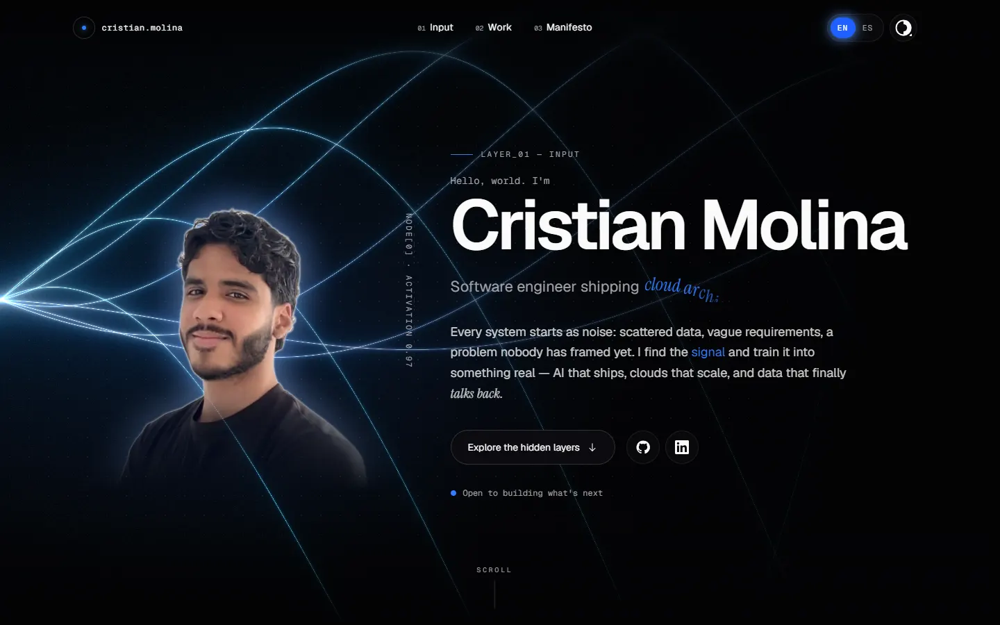
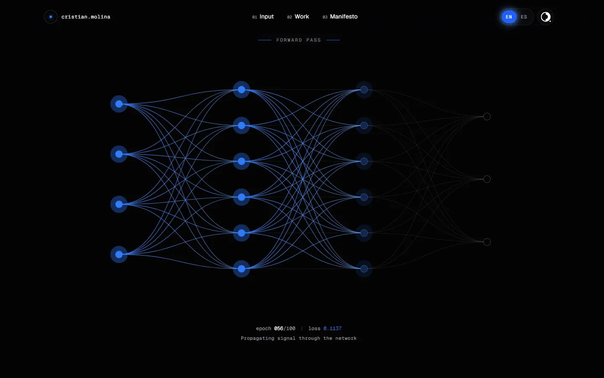
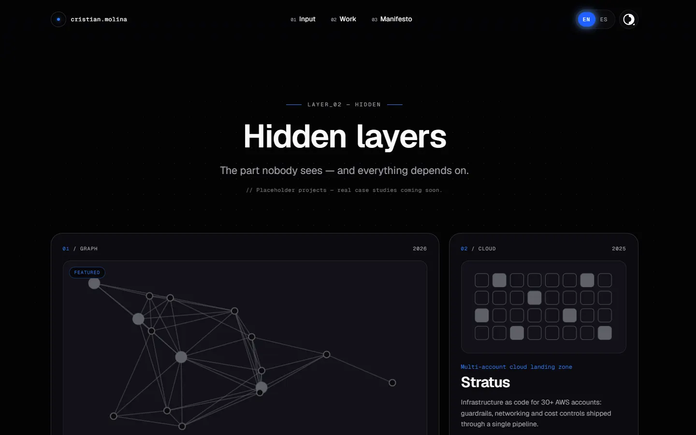
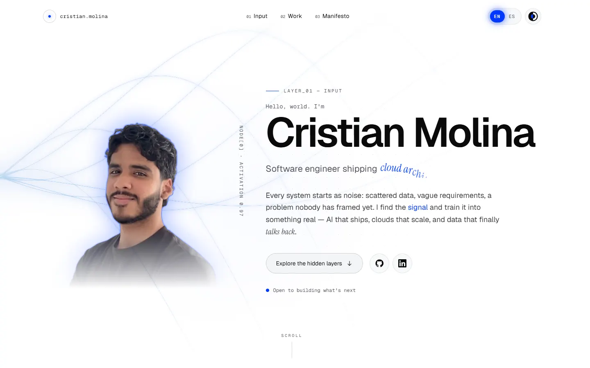
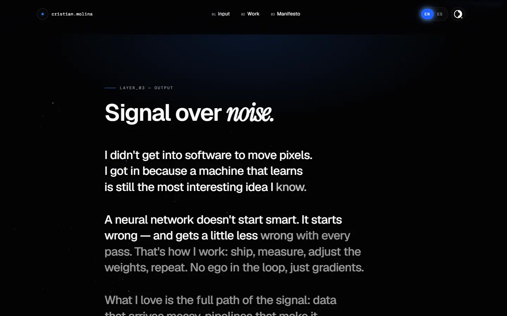

<div align="center">

# Cristian Molina — Portfolio

**Software engineer focused on AI solutions, cloud and data.**
A neural-network themed single page where scrolling _is_ a forward pass.

[](https://github.com/criskian/portfolio/actions/workflows/ci.yml)
[](https://github.com/criskian/portfolio/actions/workflows/lighthouse.yml)
[](https://github.com/criskian/portfolio/actions/workflows/codeql.yml)


[](LICENSE)



</div>

## Contents

- [Concept](#concept)
- [Highlights](#highlights)
- [Tech stack](#tech-stack)
- [Getting started](#getting-started)
- [Scripts](#scripts)
- [Project structure](#project-structure)
- [The SplashCursor rule](#the-splashcursor-rule)
- [Performance & accessibility](#performance--accessibility)
- [Editing content](#editing-content)
- [Workflow & conventions](#workflow--conventions)
- [Credits](#credits)
- [License](#license)

## Concept

The page is a network you run by scrolling:

| Layer               | Section       | What happens                                                                                                                  |
| ------------------- | ------------- | ----------------------------------------------------------------------------------------------------------------------------- |
| `layer_01 — input`  | **Hero**      | Portrait with a glowing rim, decrypting name, rotating role, "dendrite" threads. Fluid SplashCursor **on**.                   |
| ↓ _forward pass_    | Transition    | A sticky SVG network draws itself layer by layer while an `epoch / loss` read-out converges.                                  |
| `layer_02 — hidden` | **Projects**  | Bento cards with edge glow, procedural covers and decrypting titles. The pointer "activates neurons" instead: splash **off**. |
| ↓ _activation_      | Transition    | Two crossing velocity-reactive marquees, then the next section fires open from a circle.                                      |
| `layer_03 — output` | **Manifesto** | Long-form text that brightens word by word with the scroll, contact CTA. Splash **on** again.                                 |

<table>
  <tr>
    <td width="50%"></td>
    <td width="50%"></td>
  </tr>
  <tr>
    <td width="50%"></td>
    <td width="50%"></td>
  </tr>
</table>

## Highlights

- **Dark-first, bilingual.** Two toggles in the header: language (English by default, Spanish; shareable with `?lang=es`) and theme (dark by default) with a circular View Transition reveal from the button.
- **Black & white, electric blue details.** Bright blue on black, deep blue on white — every accent meets WCAG AA.
- **Portrait that adapts to the theme.** Background-free photo with pre-baked halo and rim masks: white glow in dark mode, blue in light mode, fading into the page.
- **Component libraries, tuned.** [React Bits](https://reactbits.dev) and [Skiper UI](https://skiper-ui.com) components installed through the shadcn registry and adapted for performance and accessibility (see [docs/COMPONENTS.md](docs/COMPONENTS.md)).
- **Mobile-first behaviour.** Touch devices get the lightweight version of every effect, hover effects play when a card is centred on screen, and nothing overflows from 320 px to 4K.
- **Fully static.** No backend and no runtime server work: any static host or CDN can serve it.

## Tech stack

| Area       | Choice                                                                                                   |
| ---------- | -------------------------------------------------------------------------------------------------------- |
| Framework  | [Next.js 16](https://nextjs.org) (App Router, statically prerendered) · React 19                         |
| Language   | TypeScript (strict)                                                                                      |
| Styling    | Tailwind CSS v4 · CSS custom properties for design tokens                                                |
| Motion     | [motion](https://motion.dev) (`LazyMotion` + `m`) · CSS-variable–driven scroll effects                   |
| WebGL / 2D | Fluid simulation (SplashCursor) · [ogl](https://github.com/oframe/ogl) · Canvas 2D · GSAP (DotGrid only) |
| Components | React Bits · Skiper UI (vendored via the shadcn CLI)                                                     |
| Images     | [sharp](https://sharp.pixelplumbing.com) build-time pipeline (AVIF/WebP, pre-baked glow masks)           |
| Testing    | Vitest + Testing Library · Playwright + axe                                                              |
| Tooling    | pnpm · ESLint · Prettier · husky · lint-staged · commitlint                                              |
| CI/CD      | GitHub Actions · Lighthouse CI · CodeQL · release-please · Dependabot                                    |

## Getting started

Requirements: **Node.js ≥ 20.9** (see [`.nvmrc`](.nvmrc)) and **pnpm** (the version is pinned in `package.json`).

```bash
pnpm install        # also installs the git hooks
pnpm dev            # http://localhost:3000
```

`pnpm dev` and `pnpm build` first run the image pipeline (`scripts/optimize-images.mjs`), which generates the responsive portrait and its glow masks into `public/images/generated/` (git-ignored, cached between runs).

Optional environment variable:

| Variable               | Purpose                                                       | Default                 |
| ---------------------- | ------------------------------------------------------------- | ----------------------- |
| `NEXT_PUBLIC_SITE_URL` | Canonical origin used by metadata, the sitemap and robots.txt | `http://localhost:3000` |

## Scripts

| Command          | Description                                                                                                                                               |
| ---------------- | --------------------------------------------------------------------------------------------------------------------------------------------------------- |
| `pnpm dev`       | Image pipeline + development server                                                                                                                       |
| `pnpm build`     | Image pipeline + production build                                                                                                                         |
| `pnpm start`     | Serve the production build                                                                                                                                |
| `pnpm images`    | Regenerate the portrait assets (`--force` to ignore the cache)                                                                                            |
| `pnpm lint`      | ESLint                                                                                                                                                    |
| `pnpm typecheck` | Route type generation + `tsc --noEmit`                                                                                                                    |
| `pnpm format`    | Prettier (write) · `pnpm format:check` to verify                                                                                                          |
| `pnpm test`      | Unit tests (Vitest)                                                                                                                                       |
| `pnpm test:e2e`  | End-to-end tests (Playwright) against the production build — run `pnpm build` first. Locally you can reuse an installed browser with `PW_CHANNEL=chrome`. |

## Project structure

```text
.
├── assets/source/          # original photos (not served)
├── docs/                   # architecture, design system, components, performance, content, ADRs
├── public/                 # static files (generated images land in public/images/generated)
├── scripts/                # build-time scripts (image pipeline)
├── src/
│   ├── app/                # layout, page, metadata routes (OG image, sitemap, robots, icon), globals.css
│   ├── components/
│   │   ├── cursor/         # SplashCursor (WebGL), zone store and controller
│   │   ├── layout/         # header, theme & language toggles
│   │   ├── sections/       # hero, projects, manifesto (+ footer)
│   │   ├── transitions/    # forward pass, activation bands
│   │   ├── projects/       # project card and procedural covers
│   │   ├── text/           # rich-text markup, blur and scroll reveals
│   │   ├── reactbits/      # vendored React Bits components
│   │   └── skiper/         # adapted Skiper UI components
│   ├── content/            # projects, social links, portrait metadata
│   ├── hooks/              # reduced motion, theme, in-view helpers
│   ├── i18n/               # typed EN/ES dictionaries and provider
│   └── lib/                # constants, device tiers, utilities
└── tests/                  # unit (Vitest) and e2e (Playwright)
```

More detail in [docs/ARCHITECTURE.md](docs/ARCHITECTURE.md).

## The SplashCursor rule

The fluid cursor is **active on the hero and the manifesto and disabled over the projects**. It is a hard requirement, so it is implemented and tested explicitly:

- Sections declare `data-splash="on" | "off"`. A single, persistent WebGL instance only injects fluid while the pointer is over an `on` zone.
- The fixed canvas is clipped to the visible `on` section, so fluid never paints over the projects.
- The render loop sleeps ~2.5 s after the last input: zero GPU while reading or over the projects.
- The simulation is mounted on the first pointer/touch interaction, runs at low resolution on phones and tablets, and is skipped entirely for `prefers-reduced-motion`.
- `html[data-splash-state]` mirrors the state and [`tests/e2e/splash-cursor.spec.ts`](tests/e2e/splash-cursor.spec.ts) asserts it.

## Performance & accessibility

Lighthouse on the production build (local run, simulated throttling):

| Profile                  | Performance | Accessibility | Best practices | SEO |
| ------------------------ | :---------: | :-----------: | :------------: | :-: |
| Desktop                  |     99      |      100      |      100       | 100 |
| Mobile (slow 4G, 4× CPU) |    71–78    |      100      |      100       | 100 |

Budgets are enforced in CI ([`lighthouserc.mobile.json`](lighthouserc.mobile.json), [`lighthouserc.desktop.json`](lighthouserc.desktop.json)). What makes it fast — lazy WebGL, CSS-variable–driven scroll effects, Suspense-split hydration, pre-baked image effects — is explained in [docs/PERFORMANCE.md](docs/PERFORMANCE.md).

Accessibility: semantic landmarks and headings, skip link, keyboard-operable toggles (`role="switch"`), every animated text has a plain screen-reader copy, AA contrast in both themes and full `prefers-reduced-motion` support. axe runs in the e2e suite for both themes.

## Editing content

- **Copy** (both languages): [`src/i18n/dictionaries/`](src/i18n/dictionaries) — typed against one interface, so a missing translation fails the build.
- **Projects** (currently placeholders): [`src/content/projects.ts`](src/content/projects.ts).
- **Links**: [`src/content/social.ts`](src/content/social.ts).
- **Portrait**: replace `assets/source/portrait-transparent.png` and run `pnpm images --force`.

Step-by-step guide: [docs/CONTENT.md](docs/CONTENT.md).

## Workflow & conventions

- Branch from `main`, open a pull request; CI (lint, types, format, unit, build, e2e), Lighthouse and CodeQL must pass.
- Commits and PR titles follow [Conventional Commits](https://www.conventionalcommits.org) in English (`feat`, `fix`, `perf`, `docs`, `test`, `build`, `ci`, `chore`, `refactor`, `style`, `revert`), enforced by commitlint and a PR-title check.
- [release-please](https://github.com/googleapis/release-please) turns merged commits into versioned releases and the [CHANGELOG](CHANGELOG.md).
- Decisions are recorded as ADRs in [docs/adr](docs/adr).

## Credits

- [React Bits](https://reactbits.dev) by David Haz — SplashCursor, DecryptedText, RotatingText, StarBorder, Magnet, WebThreads, BorderGlow, DotGrid, ScrollVelocity, ShinyText, Particles, ClickSpark (MIT + Commons Clause).
- [Skiper UI](https://skiper-ui.com) by Gurvinder Singh — theme toggle (skiper26), progressive blur (skiper41), text roll (skiper58), animated link (skiper40), scroll-assembled heading (skiper31). Free components used with the required attribution.
- SplashCursor is based on Pavel Dobryakov's [WebGL Fluid Simulation](https://github.com/PavelDoGreat/WebGL-Fluid-Simulation).
- Fonts: [Geist](https://vercel.com/font) and [Instrument Serif](https://fonts.google.com/specimen/Instrument+Serif).

## License

The **source code** is released under the [MIT License](LICENSE). The **personal content** — photos, texts and project descriptions — is © Cristian Molina, all rights reserved, and may not be reused without permission. Third-party components keep their own licenses (see [Credits](#credits)).
