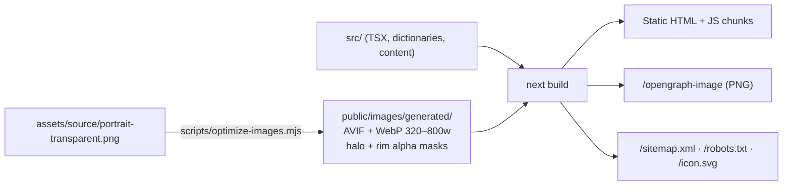
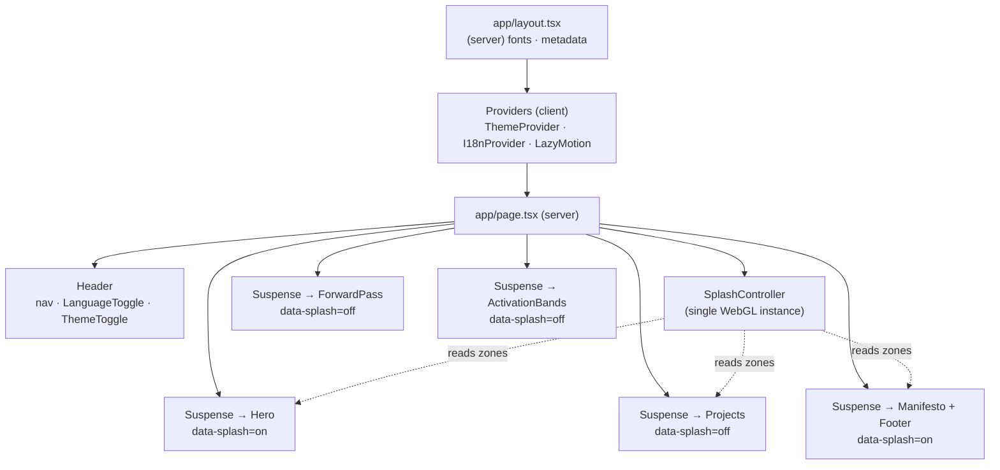
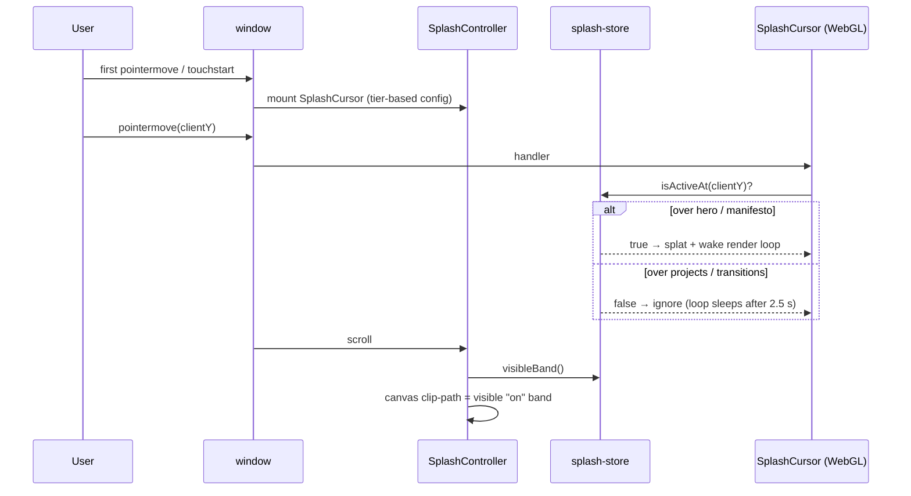

# Architecture

A single, statically prerendered page. There is no backend: everything the site
needs is known at build time, so the HTML, the Open Graph image, the sitemap and
robots.txt are all generated during `next build` (see
[ADR 0001](adr/0001-static-nextjs.md) and [ADR 0002](adr/0002-no-backend.md)).

## Build pipeline

## Runtime composition

Every section sits in its own `<Suspense>` boundary so React hydrates them as
separate units and yields to the main thread in between (shorter tasks, lower
TBT).

## Key modules

| Module                                      | Responsibility                                                                                                                                                                         |
| ------------------------------------------- | -------------------------------------------------------------------------------------------------------------------------------------------------------------------------------------- |
| `components/cursor/splash-store.ts`         | React-free store: section geometry, "is the pointer over an active zone?", visible band for clipping, current palette.                                                                 |
| `components/cursor/SplashController.tsx`    | Owns the one SplashCursor instance: lazy mount on first interaction, device tier, clip-path updates, `html[data-splash-state]`, reduced-motion opt-out.                                |
| `components/cursor/SplashCursor.tsx`        | WebGL fluid simulation (React Bits port) with zone-gated input and a sleeping render loop.                                                                                             |
| `i18n/`                                     | Typed dictionaries (`Dictionary` interface) + client provider. English is in the static HTML; Spanish is a runtime switch (`?lang=es`) — see [ADR 0003](adr/0003-client-side-i18n.md). |
| `components/text/rich.ts`                   | Tiny markup for the copy: `**accent**` and `_serif italic_`.                                                                                                                           |
| `components/text/*Reveal*` / `BlurRichText` | Text effects driven by one CSS custom property or one IntersectionObserver per block — no per-word JS.                                                                                 |
| `components/transitions/ForwardPass.tsx`    | Scroll-linked SVG network, mounted on demand, animated through CSS variables.                                                                                                          |
| `content/`                                  | Projects (typed, bilingual), social links, portrait metadata.                                                                                                                          |
| `lib/device.ts`                             | Performance tier detection (`high` / `medium` / `low`), WebGL detection, idle scheduling.                                                                                              |

## Theme and hydration

`next-themes` sets the `dark` / `light` class before first paint (dark is the
default, system preference is ignored on purpose). Colours are CSS variables, so
most components never need the theme in JavaScript. Where a value must be
computed in JS (WebGL colours, inline styles of vendored components),
`useIsLight()` reports _dark_ until the component is mounted, avoiding hydration
mismatches between the server HTML and a stored light preference.

## SplashCursor zones

See [ADR 0004](adr/0004-splash-cursor-zones.md) for why a single persistent
instance with zone gating was chosen over mounting/unmounting per section.
